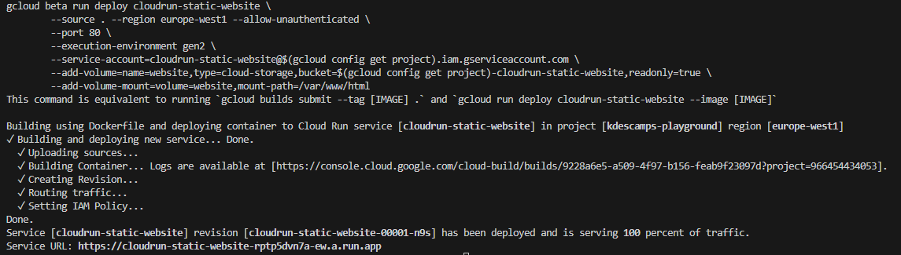

# Static Website with CloudRun and Cloud Storage volume

This folder contains an example of how to use CloudRun and Cloud Storage volume to serve a static website.

## Prerequisites

Before getting started, make sure you have the following:

- A Google Cloud Platform (GCP) account
- The Cloud SDK (`gcloud`) installed and configured
- A project created on GCP

## Setup

1. Clone this repository to your local machine:

   ```bash
   git clone https://github.com/descampsk/cloudrun-playground.git
   ```

2. Change to the directory that contains the sample code:

   ```bash
   cd cloudrun-playground/static-website
   ```

3. Create a new Cloud Storage bucket, a service account and the necessary permissions:

   ```bash
   make init-cloud-resources
   ```

4. Copy the static website to the Cloud Storage bucket:

   ```bash
   make copy-files-to-cloud-storage
   ```

5. Deploy the CloudRun service:

   ```bash
   make deploy-cloud-run
   ```

   

6. Open the website in your browser via the URL provided by the previous command. You should see an working Incremental Counter

   
